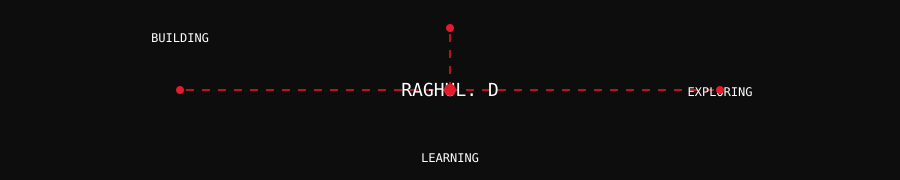
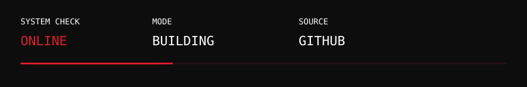
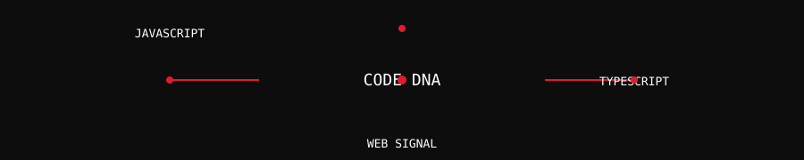
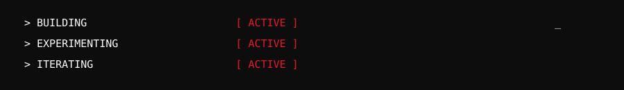
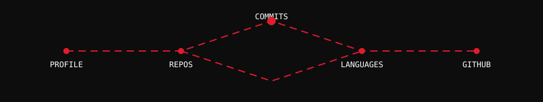
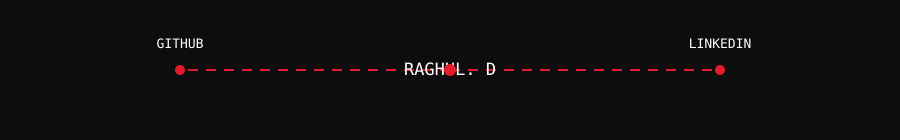

  

# RAGHUL. D

**DEVELOPER // BUILDER // CREATIVE TECHNOLOGIST**

`SYSTEM STATUS` **ONLINE**

*Every project is another web.*

<a href="https://github.com/Raghul-123-hub">GitHub</a> &nbsp; / &nbsp;
<a href="https://www.linkedin.com/in/raghul-d-467729425/">LinkedIn</a>

---

## // SYSTEM MAP

`01` [ABOUT RAGHUL](#-about-raghul) &nbsp; `02` [DEVELOPMENT SIGNAL](#-development-signal) 
`03` [ACTIVE MISSIONS](#-active-missions) &nbsp; `04` [CODE DNA](#-code-dna) 
`05` [CURRENTLY BUILDING](#-currently-building) &nbsp; `06` [UPGRADING SYSTEM](#-upgrading-system) 
`07` [ACTIVITY NETWORK](#-activity-network) &nbsp; `08` [CONNECT](#-connect) &nbsp; `09` [SYSTEM ONLINE](#-system-online)

## // ABOUT RAGHUL ● ACTIVE

`[01]` I build working digital experiences. 
`[02]` I explore software projects, coursework repositories, and web interfaces. 
`[03]` I keep learning through public experiments on GitHub.

## // DEVELOPMENT SIGNAL ● ONLINE

| SIGNAL | STATE |
| :--- | :--- |
| PROFILE | [`@Raghul-123-hub`](https://github.com/Raghul-123-hub) |
| MODE | BUILDING |
| REPOSITORIES | [LIVE INDEX](https://github.com/Raghul-123-hub?tab=repositories) |
| STARS | [VIEW ON GITHUB](https://github.com/Raghul-123-hub?tab=stars) |

> Repository, contribution, and star counts remain live on GitHub rather than being frozen in this README.

## // ACTIVE MISSIONS ● SCANNING

Each mission is a real public repository. The cards reveal as the page loads; the text remains readable without animation.

### MISSION 01 / `content-ops-starter`

`STATUS: ACTIVE` &nbsp; `SIGNAL: TYPESCRIPT` &nbsp; `LICENSE: MIT`

Public TypeScript repository with a verified MIT license. No public repository description is currently set.

[SOURCE CODE](https://github.com/Raghul-123-hub/content-ops-starter)

### MISSION 02 / `nextjs-boilerplate`

`STATUS: ACTIVE` &nbsp; `SIGNAL: TYPESCRIPT` &nbsp; `DEPLOYMENT: VERCEL`

Public TypeScript repository with a Vercel homepage linked from GitHub.

[SOURCE CODE](https://github.com/Raghul-123-hub/nextjs-boilerplate) &nbsp; [LIVE HOMEPAGE](https://nextjs-boilerplate-pied-ten-72.vercel.app)

### MISSION 03 / `FSF0101`

`STATUS: ACTIVE` &nbsp; `SIGNAL: JAVASCRIPT`

Public JavaScript repository with no public description currently set.

[SOURCE CODE](https://github.com/Raghul-123-hub/FSF0101)

### MISSION 04 / `CSA1264`

`STATUS: ACTIVE` &nbsp; `SIGNAL: LANGUAGE NOT DECLARED`

Public repository with no description or detected primary language currently exposed by GitHub.

[SOURCE CODE](https://github.com/Raghul-123-hub/CSA1264)

### MISSION 05 / `Stzz`

`STATUS: ACTIVE` &nbsp; `SIGNAL: LANGUAGE NOT DECLARED`

Public repository with no description or detected primary language currently exposed by GitHub.

[SOURCE CODE](https://github.com/Raghul-123-hub/Stzz)

### MISSION 06 / `CSA0703`

`STATUS: ACTIVE` &nbsp; `SIGNAL: LANGUAGE NOT DECLARED`

Public repository with no description or detected primary language currently exposed by GitHub.

[SOURCE CODE](https://github.com/Raghul-123-hub/CSA0703)

## // CODE DNA ● CONNECTED

| VERIFIED LANGUAGE SIGNAL | PUBLIC REPOSITORIES |
| :--- | :--- |
| `TYPESCRIPT` | `content-ops-starter`, `nextjs-boilerplate` |
| `JAVASCRIPT` | `FSF0101` and additional public repositories |
| `HTML` | Additional public repositories |
| `PYTHON` | Additional public repositories |

GitHub remains the source of truth for the complete language distribution.

## // CURRENTLY BUILDING ● ITERATING

- Web interface and application experiments represented by the TypeScript repositories.
- Coursework-driven software repositories identified by the `CSA` and `FSF` projects.
- Creative technology exploration through public software experiments.

## // UPGRADING SYSTEM ● EXPLORING

These bars are visual indicators, not measured proficiency scores.

`EXPLORING` TypeScript and JavaScript application work. 
`EXPERIMENTING` with web interfaces, repository structure, and deployed web projects. 
`BUILDING WITH` public GitHub workflows and focused software experiments.

## // ACTIVITY NETWORK ● LIVE SOURCE

  <a href="https://github.com/Raghul-123-hub">OPEN THE LIVE GITHUB ACTIVITY NETWORK</a>

GitHub renders the contribution graph and activity history on the live profile. This link uses that authoritative source directly instead of a third-party chart service.

## // CONNECT ● CHANNEL OPEN

| CHANNEL | LINK |
| :--- | :--- |
| GITHUB | [Raghul-123-hub](https://github.com/Raghul-123-hub) |
| LINKEDIN | [Raghul D](https://www.linkedin.com/in/raghul-d-467729425/) |

## // SYSTEM ONLINE

**RAGHUL. D** 
**KEEP BUILDING.** 
**KEEP EXPLORING.**

`SYSTEM ONLINE`

*The web never stops.*

